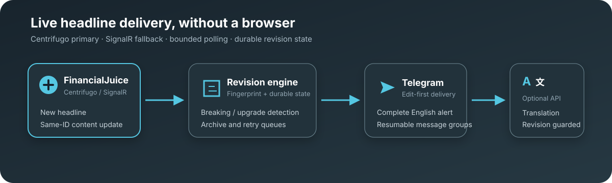
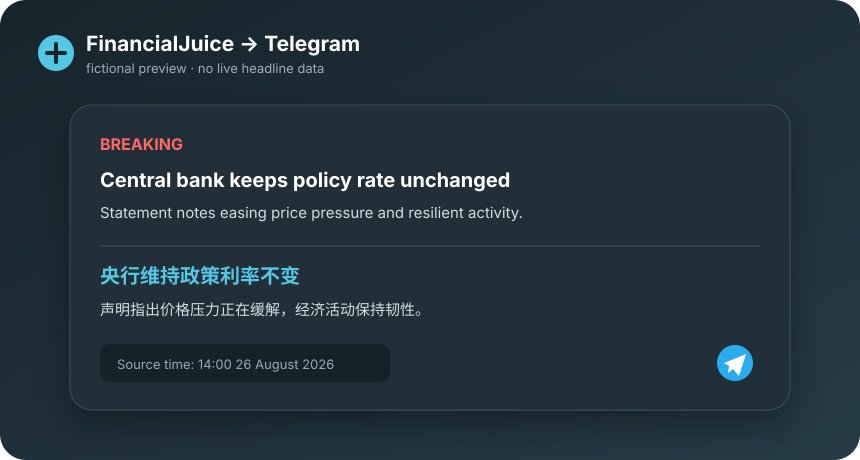

<div align="center">
  <table>
    <tr>
      <td bgcolor="#242d38" align="center">
        <a href="https://www.financialjuice.com/">
          
        </a>
      </td>
    </tr>
  </table>
  <h1>Unofficial FinancialJuice → Telegram Monitor</h1>
  <p><strong>Durable breaking-news alerts, same-ID revision updates, and optional bilingual delivery.</strong></p>
  <p>
    
    
    
    
  </p>
</div>



This headless monitor follows FinancialJuice's live Centrifugo feed, retains a
legacy Azure SignalR path, and falls back to bounded HTTP polling when sockets
are unhealthy. It detects breaking upgrades and edits to an existing `NewsID`,
archives every accepted revision, and updates Telegram without requiring a
browser. Optional English-to-Chinese translation works with any
OpenAI-compatible Chat Completions API.

> **Not affiliated with FinancialJuice, Telegram, or any translation provider.**
> This is an independent client that reads FinancialJuice's public feed and
> republishes it; it does not publish back to FinancialJuice.
> You are responsible for using it in accordance with the terms and policies of
> every service you connect.
>
> FinancialJuice and its logo are trademarks of their respective owner. The
> official logo above is loaded from FinancialJuice's public website and is used
> only to identify the service this independent client connects to. See the
> [FinancialJuice Terms of Service](https://www.financialjuice.com/tos.aspx).

## Contents

- [Features](#features)
- [Preview](#preview)
- [How it works](#how-it-works)
- [Reliability model](#reliability-model)
- [Quick start](#quick-start)
- [Configuration](#configuration)
- [Translation providers](#translation-providers)
- [Project layout](#project-layout)
- [Testing](#testing)
- [Security and privacy](#security-and-privacy)
- [Limitations](#limitations)
- [Troubleshooting](#troubleshooting)
- [Project status](#project-status)

## Features

- **Real-time feed** over Centrifugo, with automatic reconnect, exponential
  backoff, and a polling fallback so a dead socket never means a dead monitor.
- **Revision awareness**: breaking-news flags, breaking-upgrade transitions,
  and same-ID editorial edits are all detected and handled separately from
  brand-new headlines.
- **Durable state**: revision tracking and archive writes survive restarts,
  with bounded retry queues under `data/` instead of silent drops.
- **Telegram delivery** that resumes cleanly across multi-message posts when a
  single alert would exceed Telegram's message limits.
- **Non-blocking translation**: a revision-guarded background worker adds
  Chinese translations after the English alert is already live, and can never
  stall the ingress path.
- **Provider-neutral translation config** for Kimi/Moonshot, OpenAI,
  DeepSeek, OpenRouter, or any local OpenAI-compatible server.
- **No browser automation**: login, token discovery, feed ingestion, and
  fallback polling all use HTTP/WebSocket clients.
- **Built-in liveness monitoring**: the monitor updates `/tmp/healthcheck`,
  while Docker Compose and the internal watchdog detect stale heartbeats.

If translation fails for any reason (timeout, network error, non-success
response, oversized response, malformed response) the English alert is left
exactly as published, and a stale translation job can never overwrite a newer
English revision.

## Preview

<div align="center">
  
</div>

The preview is generated for this repository and uses fictional content. Real
messages contain the FinancialJuice source time, the latest accepted editorial
revision, and a translation only when translation is explicitly enabled.

## How it works

| Stage | Responsibility |
|---|---|
| Feed ingress | Centrifugo first, SignalR compatibility path, polling after repeated WS failures |
| Revision engine | Normalizes `NewsID`, fingerprints title/description, detects upgrades and edits |
| Durable state | Persists accepted revisions, archive work, Telegram targets, and resume progress |
| Telegram | Publishes English immediately, edits in place when possible, chunks long updates safely |
| Translation | Runs in a bounded background queue and can never overwrite a newer English revision |

### Translation flow

1. The monitor publishes the complete English alert immediately, without
   waiting on translation.
2. A single `asyncio.Queue` worker sends the shared system prompt and the full
   editorial text to `{FJ_TRANSLATE_BASE_URL}/chat/completions`.
3. The translated result edits the original Telegram message, or publishes a
   numbered replacement group when Telegram's length limits require it.

Example output:

```text
🚨 Fed's Powell: We are committed to bringing inflation back to 2% target
———
美联储鲍威尔：致力于将通胀拉回 2% 目标

Source time: 18:51 08 April 2026
```

The shared system prompt lives in
[`src/translate/prompts/news_zh.md`](src/translate/prompts/news_zh.md). The
translation client never truncates input it accepts; oversized input is
rejected earlier by `news_processor`, and the English alert is unaffected
either way.

## Reliability model

- **Feed layer**: Centrifugo is primary; SignalR and interval polling are
  fallbacks, each with its own reconnect/backoff so one failure mode doesn't
  cascade into the others.
- **State layer**: revision state and archive writes are durable across
  restarts, and archive retries are bounded rather than infinite or silently
  dropped.
- **Delivery layer**: Telegram publication and translation are decoupled.
  Translation API errors, timeouts, or malformed responses are contained to
  the background worker and never affect FinancialJuice monitoring or the
  English Telegram post.
- **Ordering guarantee**: translations are revision-guarded, so a slow
  translation job cannot clobber a newer English edit that arrived while it
  was in flight.

This is a best-effort reliability design, not a formal SLA. It has not been
load-tested against feed-wide outages or provider-side rate limiting beyond
normal operation.

## Quick start

### Prerequisites

- Docker and Docker Compose
- A FinancialJuice account
- A Telegram bot token and target chat (or forum topic) ID
- Optional: an API key for an OpenAI-compatible translation provider, or an
  unauthenticated local compatible server

### Run

```bash
git clone https://github.com/SeaL773/financialjuice-telegram-monitor.git
cd financialjuice-telegram-monitor
cp .env.example .env
# Fill in FinancialJuice, Telegram, and optional translation variables.
docker compose up -d --build
docker compose logs -f
```

Translation is opt-in. Set `FJ_TRANSLATE_ENABLED=true` only after configuring a
provider you trust; the default is English-only and sends no news text to a
translation service.

## Configuration

All configuration is supplied through environment variables (see
`.env.example`).

### Core

| Variable | Required | Default | Description |
|---|---:|---|---|
| `FJ_EMAIL` | yes | n/a | FinancialJuice account email |
| `FJ_PASSWORD` | yes | n/a | FinancialJuice account password |
| `TG_BOT_TOKEN` | yes | n/a | Telegram bot token |
| `TG_CHAT_ID` | yes | n/a | Target chat ID |
| `TG_THREAD_ID` | no | `0` | Optional positive forum topic ID; `0`, blank, or invalid values disable topics |
| `FJ_COOKIES_PATH` | no | `data/cookies.json` | Persisted FinancialJuice session cookies |
| `FJ_WS_RECONNECT_BASE_DELAY` | no | `3` | Initial WebSocket retry delay (seconds) |
| `FJ_WS_RECONNECT_MAX_DELAY` | no | `60` | Maximum WebSocket retry delay (seconds) |
| `FJ_WS_RECEIVE_TIMEOUT` | no | `180` | Reconnect when no WebSocket protocol frame is received within this many seconds |
| `FJ_POLL_FALLBACK_INTERVAL` | no | `15` | Polling interval while the socket is unhealthy (seconds) |
| `FJ_FEEDTOKEN_REFRESH_HOURS` | no | `6` | `/home` feed token refresh interval (hours) |

### Translation

| Variable | Required | Default | Description |
|---|---:|---|---|
| `FJ_TRANSLATE_ENABLED` | no | `false` | Explicitly opt in to the background translation worker |
| `FJ_TRANSLATE_API_KEY` | no | empty | Bearer token; may be empty for unauthenticated local servers |
| `FJ_TRANSLATE_BASE_URL` | no | `https://api.moonshot.cn/v1` | API base URL; `/chat/completions` is appended exactly, with no automatic `/v1` |
| `FJ_TRANSLATE_MODEL` | no | `moonshot-v1-8k` | Compatible model identifier |
| `FJ_TRANSLATE_TIMEOUT` | no | `60` | HTTP timeout in seconds (always finite) |
| `FJ_TRANSLATE_MAX_TOKENS` | no | `256` | Output token limit |
| `FJ_TRANSLATE_TEMPERATURE` | no | `0.3` | Sampling temperature |
| `FJ_TRANSLATE_HEADERS_JSON` | no | `{}` | JSON object of extra string-to-string headers |
| `FJ_TRANSLATE_EXTRA_BODY_JSON` | no | `{}` | JSON object merged into the request body |
| `FJ_TRANSLATE_PROMPT_FILE` | no | `src/translate/prompts/news_zh.md` | System prompt path |

Header merge rules: custom header names are compared case-insensitively, and
the first custom occurrence of a given name wins over later casing variants.
`Content-Type` is always emitted exactly once as `application/json`. When
`FJ_TRANSLATE_API_KEY` is set, its generated Bearer `Authorization` header
replaces every custom casing variant and is emitted exactly once; when the key
is empty, the first custom `Authorization` casing variant is allowed through.
Canonical body fields (`model`, `messages`, `temperature`, `max_tokens`) always
take precedence over matching keys in `FJ_TRANSLATE_EXTRA_BODY_JSON`.

Translation responses are streamed with a finite 2 MiB cap: a declared
oversized response is rejected before any body is read, and a chunked
response stops being read the moment the accumulated limit is exceeded.

`KIMI_API_KEY`, `KIMI_BASE_URL`, and `KIMI_MODEL` remain as deprecated aliases
for existing deployments. Their `FJ_TRANSLATE_*` equivalents always take
precedence when both are set.

## Translation providers

Pick any base URL / model pair from an OpenAI-compatible provider:

| Provider | Base URL | Model example |
|---|---|---|
| Kimi/Moonshot | `https://api.moonshot.cn/v1` | `moonshot-v1-8k` |
| OpenAI | `https://api.openai.com/v1` | `gpt-4.1-mini` |
| DeepSeek | `https://api.deepseek.com/v1` | `deepseek-chat` |
| OpenRouter | `https://openrouter.ai/api/v1` | `openai/gpt-4.1-mini` |
| Local server | `http://host.docker.internal:8000/v1` | server-defined model ID |

<details>
<summary><strong>OpenRouter header example</strong></summary>

```env
FJ_TRANSLATE_HEADERS_JSON={"HTTP-Referer":"https://github.com/SeaL773/financialjuice-telegram-monitor","X-OpenRouter-Title":"financialjuice-telegram-monitor"}
```

</details>

## Project layout

```text
financialjuice-telegram-monitor/
├── main.py
├── Dockerfile                       # python:3.11-slim base image
├── docker-compose.yml
├── requirements.txt
├── .env.example
├── tests/                           # ingress, Centrifugo, revisions, translation
└── src/
    ├── auth/                        # FinancialJuice WebForms login
    ├── api/                         # /home discovery, WS clients, polling fallback
    ├── archive/                     # durable JSON archives
    ├── core/                        # configuration, monitor loop, processor, limits
    ├── telegram/                    # Telegram rendering and publication
    ├── translate/
    │   ├── queue_worker.py          # background, revision-guarded jobs
    │   ├── translator.py            # generic async httpx Chat Completions client
    │   └── prompts/news_zh.md       # shared translation prompt
    └── utils/                       # logging
```

## Testing

Tests are plain `unittest` (no extra test runner required):

```bash
python -m unittest discover -s tests
```

Coverage includes ingress parsing, Centrifugo message handling, revision
detection, WebSocket client type validation, and the translation client's
header/body merge and streaming-limit behavior.

## Security and privacy

- **Treat `data/cookies.json`, `.env`, and any `FJ_TRANSLATE_API_KEY` /
  `TG_BOT_TOKEN` value as credentials.** They grant access to a live
  FinancialJuice session, your Telegram bot, and (if set) a paid translation
  API respectively.
- `.env` and `data/` are already listed in `.gitignore`. Before making a fork
  or clone public, confirm your own `.git` history never had real credentials
  committed; if it did, rotate every exposed secret and scrub the history
  (`git filter-repo` or the BFG Repo-Cleaner) rather than assuming a later
  commit fixed it.
- The monitor only reads from FinancialJuice's feed; it never writes back to
  it, and it has no code path that could modify your FinancialJuice account
  beyond the login itself.
- Translation requests send the full English headline/editorial text to
  whichever `FJ_TRANSLATE_BASE_URL` you configure. Only point this at a
  provider and account you trust with that data.
- See [SECURITY.md](SECURITY.md) for how to report a vulnerability.

## Limitations

- No automated CI is configured in this repository; tests must be run
  manually before and after changes.
- The Docker healthcheck and internal watchdog depend on `/tmp/healthcheck`.
  The monitor updates this heartbeat from active WebSocket, keepalive, and
  polling paths; an unhealthy container usually indicates that all of those
  paths have stopped making progress.
- Reconnect/backoff and polling reduce outage impact but do not guarantee
  zero missed headlines during an extended FinancialJuice or network outage.
- Translation quality depends entirely on the configured provider and model;
  this project does not validate translation accuracy.
- Tested against the FinancialJuice web feed as it exists at the time of
  writing. Upstream changes to Centrifugo, SignalR, or the `/home` endpoint
  may require code changes to keep working.

## Troubleshooting

| Symptom | Likely cause | Where to look |
|---|---|---|
| No messages arrive at all | Bad Telegram credentials, or FJ login failing | Startup logs for auth errors; verify `TG_BOT_TOKEN`/`TG_CHAT_ID` |
| Feed drops and reconnects repeatedly | Network instability, or FinancialJuice rate limiting | `FJ_WS_RECONNECT_*` delays in logs; consider raising `FJ_WS_RECONNECT_MAX_DELAY` |
| Falls back to polling and stays there | Persistent socket failure | `FJ_POLL_FALLBACK_INTERVAL` cadence in logs; check upstream feed availability |
| English alerts post but Chinese translation never appears | Translation disabled, or provider error | Confirm `FJ_TRANSLATE_ENABLED=true`; check worker logs for timeout/HTTP errors |
| Repeated login failures after working before | FinancialJuice session/cookies invalidated | Delete the file at `FJ_COOKIES_PATH` to force a fresh login |
| Container marked unhealthy despite normal logs | No WS, keepalive, or polling heartbeat within the configured window | Inspect `/tmp/healthcheck`, upstream connectivity, and watchdog logs |

## Project status

Actively used for personal FinancialJuice monitoring; contributions and
issue reports are welcome, but there is no formal support commitment or SLA.

## License

Released under the [MIT License](LICENSE).
